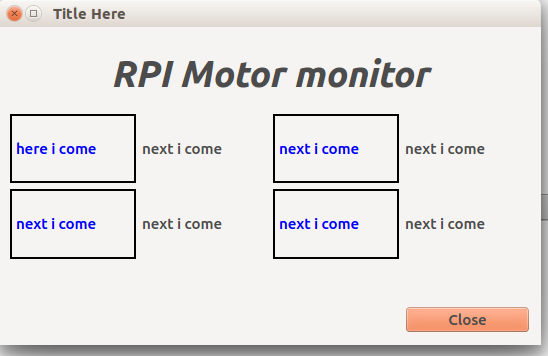

# Rpi data monitor starter project

This project provides a gui for showing stats from rpi.
<br>
I have kept 4 fields for now but that can be increased by changing the `.ui` file.
And then using the `pyui4` translate it to a `py` file.

<hr>
## Requirement

+ `pyqt4`

<br>
<hr>
## How to install it on rpi 

```
sudo apt-get install python-qt4 python-qt4-dbus python-qt4-dev python-qt4-doc python-qt4-gl python-qt4-phonon python-qt4-sql python-qtmobility python-qwt3d-qt4 python-qwt5-qt4 python3-dbus.mainloop.qt python3-pyqt4 python3-pyqt4.phononpython3-pyqt4.qsci python3-pyqt4.qtopengl python3-pyqt4.qtsql 
```


<br>
For now the UI looks like this.




** the motor monitor is  a place Holder**

<br>
<hr>
## TODO

<br>
+ Provide a realtime graph to show the changing values.
+ use slots and events instead of a seperate thread. ( using seperate threads is not so Qt style) 
